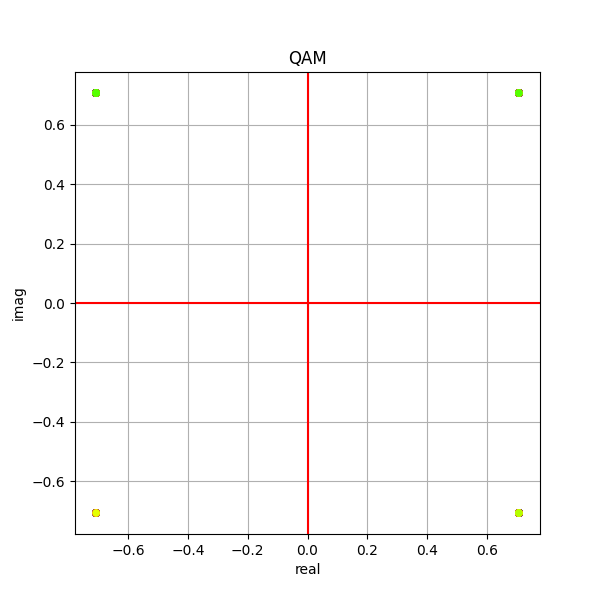
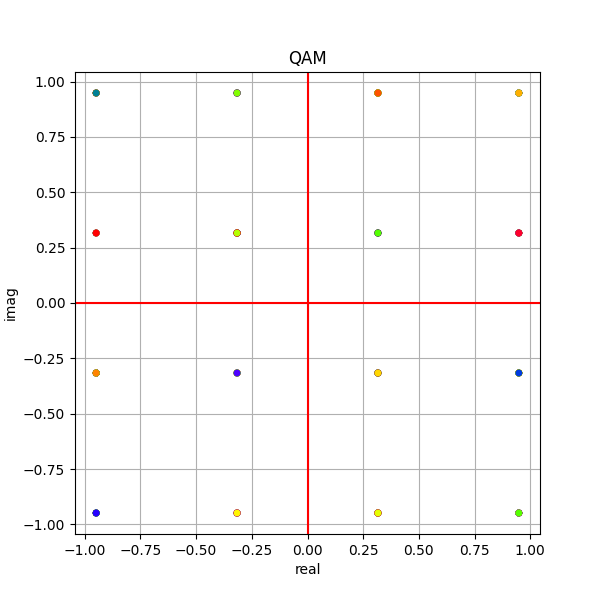
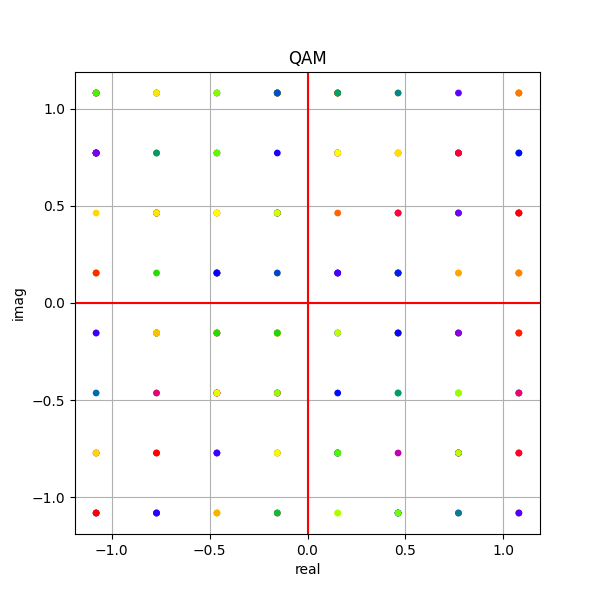
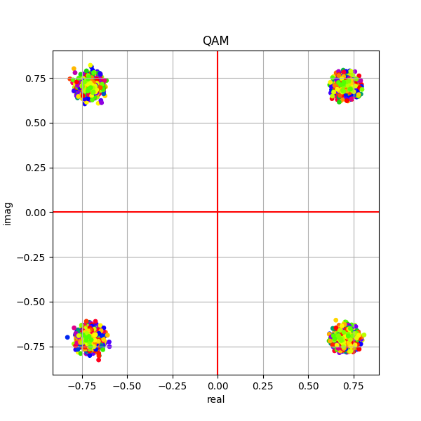
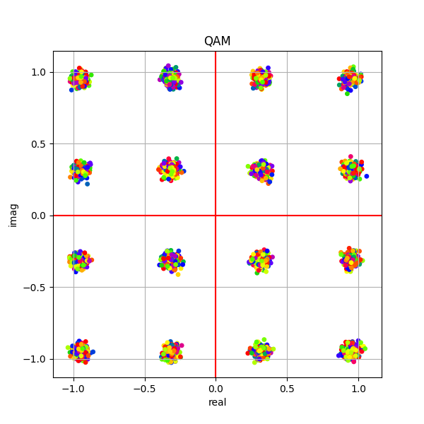
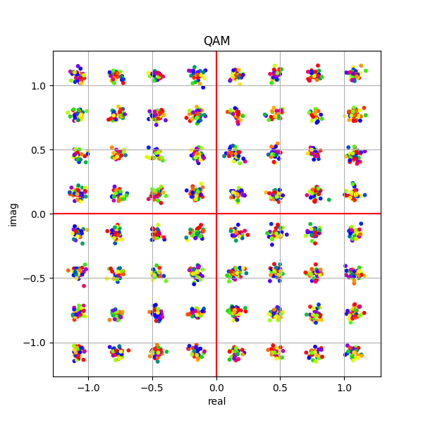
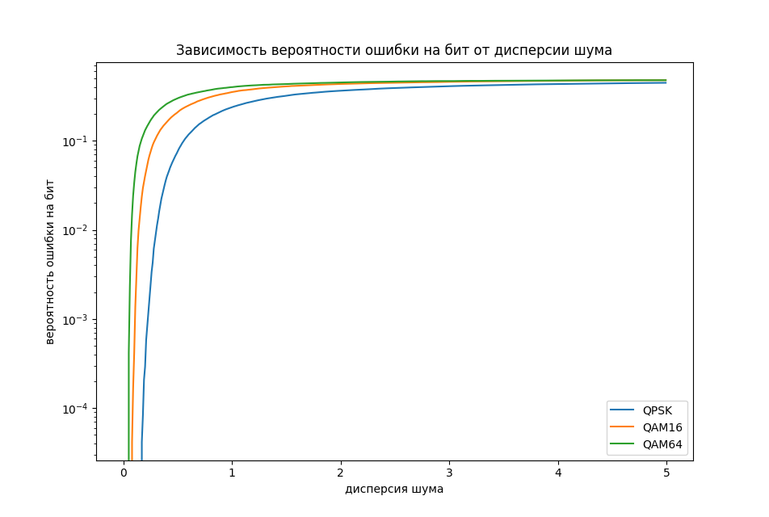

# Yadro_test

1.	Написать на языке С++ класс выполняющий функциональность модулятора QAM (QPSK, QAM16, QAM64)

2.	Написать на языке С++ класс выполняющий функциональность добавления гауссовского шума к созвездию QAM

3.	Написать на языке С++ класс выполняющий функциональность демодулятора QAM (QPSK, QAM16, QAM64)

- QPSK демодулировал по четвертям

- QAM16, QAM64 создавал словарь с ключем: вектор битов, значение: комплексное значение символа и выбирал ближайшее к точке значение.

4.	Написать последовательный вызов 1-3 для случайной последовательности бит для разных значений дисперсия шума

- дисперсия шума изменяется с 0 до 5 с шагом 0.01

5.	Построить график зависимости вероятности ошибки на бит от дисперсии шума

